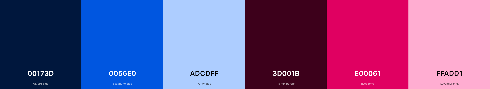

# Calorie Tracker

## Introduction

👋 Welcome to the Calorie Tracker App! This application is designed to help you monitor your daily calorie intake and manage your nutritional goals effectively.

🎯 Whether you're looking to lose weight, maintain a healthy diet, or simply track your food consumption, our app provides you with the tools you need.

[Link to Calorie Tracker website](https://calorie-tracker505-bba2b7fbcdfa.herokuapp.com/)

## Why choose our Calorie Tracker?

1. **User-Friendly Interface:** We offer an intuitive and easy-to-navigate interface, making it effortless for users to log their meals and track their calorie intake without any hassle.

2. **Comprehensive Meal Logging:** Easily log all your meals, snacks, and beverages throughout the day, ensuring you have a complete overview of your nutritional intake.

3. **Automatic Calorie Calculation:** Our app automatically calculates the total calories consumed based on the foods logged, saving you time and effort in manual calculations.

4. **Visual Progress Tracking:** Visualise your daily, weekly, and monthly calorie consumption trends through charts and graphs, providing insights into your eating habits and progress over time.

5. **Mobile Accessibility:** Access our Calorie Tracker on the go with mobile responsiveness, allowing you to log meals and monitor your progress wherever you are.

6. **Data Privacy and Security:** We prioritize the security and privacy of your data, ensuring that all your personal information and dietary logs are kept confidential and secure.

## User Stories

As a User:
|I want to.. | So that I can.. | Acceptance Criteria
| ----------- | ----------- | ----------- |
| Sign up for an account. | Track my calorie intake. | 1: The user can access a sign up from the homepage and navbar. 2: The form requires a unique username, email and password.
| Log into my account. | Access my personal data. | 1: The user can access a login form from the homepage and navbar. 2: The user must enter a valid username and password to log in. 3: Upon successful login, the user is redirected to their dashboard.
| Navigate the site easily using a clean and intuitive interface. | Quickly find and use the features I need. | 1: The user can access main features (profile, food log, weight history) from a clear and intuitive navigation menu. 2: All pages are designed with a consistent layout and design.
| See my data presented in a clear and visually appealing manner using charts and graphs. | Better understand my progress and dietary habits. | 1: The user can view their data (food intake, macronutrient breakdown, weight history) in charts and graphs. 2:The data is updated in real-time as new entries are logged.
| View my basic information. | Keep track of my account activity. | 1: The user can view their username, join date, and last login date on their profile page. 2: The information is displayed in a clear and readable format.
| See a history of my previous weights and calorie additions. | Monitor my progress. | 1: The user can access their history from/on their profile. 2: The history shows a list of previous weights and calorie additions in chronological order. 3: Each entry includes the date, weight, and calorie addition details.
| Log my daily food intake. | Track my calorie consumption. | 1: The user can access a food log form from their dashboard. 2: The form allows the user to select food items and enter quantities. 3: A confirmation message is displayed upon successful logging of food intake.
| See a log of my previous food intakes. | Review my eating habits over time. | 1: The user can access a log history from their dashboard. 2: The log history displays a list of previous food intakes with dates and details. 3: The user can sort or filter the log history by date or food type.
| Record my weight. | Monitor my weight changes over time. | 1: The user can access a weight entry form from their dashboard. 2: The form requires the user to enter their current weight. 3: A confirmation message is displayed upon successful weight entry.
| View a weight history chart that updates with each new entry. | Visualise my weight trends. | 1: The user can view a weight history chart on their dashboard. 2: The chart updates dynamically with each new weight entry. 3: The chart displays weight trends over time.
| View a macronutrient breakdown chart of my logged food. | Understand my nutritional intake in terms of fats, carbs, and protein. | 1: The user can view a macronutrient breakdown chart on their dashboard. 2: The chart updates dynamically based on the logged food intake. 3: The chart shows the proportions of fats, carbs, and protein.
| See a list of food items along with their nutritional values. | Choose what to eat based on my dietrary needs. | 1: The user can access a foods list from the homepage and navbar. 2: Each food item displays its name, category, and nutritional values (fats, carbs, protein).
| Add a new food item by filling out required fields. | Log foods that are not already in the database. | 1: The user can access an 'Add Food' form from the food list page and navbar. 2: The form requires fields for name, category and nutritional values. 3: A confirmation message is displayed upon successful addition of a new food item.
| View food items by category. | Easily find what I am looking for. | 1: The user can filter food items by category via the navbar. 2: Only food items within their selected category are dispalyed.
| Ensure my personal and health data is stored securely. | Ensure my privacy is protected. | 1: All personal and health data is encrypted in the database. 2: The user’s data is not shared with third parties without consent.
| Ensure my password and personal information is stored securely. | Ensure my privacy is protected. | 1: Passwords are stored using secure hashing algorithms. 2: The application uses HTTPS to secure data transmission.

As an Admin:
|I want to.. | So that I can.. | Acceptance Criteria
| ----------- | ----------- | ----------- |
| Add food items to the food tracker app through the Django admin interface. | Ensure users have a more comprehensive food database to choose from. | 1: The admin can access the food management interface through the Django admin dashboard. 2: The admin can add new food items by entering required details. 3: A confirmation message is displayed upon successful addition.
| Upload images for food items. | Ensure users can have a visual reference for the foods they are logging. | 1: The admin can upload images for food items through the Django admin dashboard. 2: The uploaded images are displayed alongside the corresponding food items in the food list.

## Workflow
### Agile Methodology
For this project I adopted an Agile methodology. This is the first time I have used this on a solo project, however, I have used it as a group during three previous hackathons. This has helped me to: 
- Organise and prioritise my workflow.  This has been essential due to the very limited timeframe we had to complete this project.
- Enabled me to adjust my expectations and still produce the required MVP

I created a site map and workflow diagram: 

I used Github projects to convert my user stories into actionable tasks. The acceptance criteria was very helpful to ensure all necessary tasks were completed.

## Design
### Wireframes and Features

This site is fully responsive and accessible on mobile, tablet and desktop devices.

Homepage Wireframe:

Food Log Wireframe:

User Profile Wireframe:

**All Users:**
- Are able to view added items
- Are able to access log in or register

**Add images of pages for logged out users** 🛑

Homepage:

Login:

**Logged in Users:**
- Are able to view items by category
- Are able to add new items
- Are able to access their personal food log
- Are able to access their personal profile
- Are able to log out

**Add images of pages for logged in users** 🛑

User Profile:

## Design Choices
### Colours

I used [coolors.co](https://coolors.co/00173d-0056e0-adcdff-3d001b-e00061-ffadd1) to generate my colour pallet:

I chose a clean and simple website design that prioritises content. Using a vibrant color scheme, I aimed to balance minimalism with boldness. The off-white background (#f1f1f1) maintains simplicity and cleanliness, while splashes of color inject visual interest against this neutral backdrop. This approach creates a modern aesthetic that is stylish yet restrained.

The combination of blue and raspberry forms a harmonious contrast, complemented by cool off-white tones, ensuring a cohesive and balanced palette. Neutral colors were selected to promote overall harmony.

The result is a thoughtfully curated color palette that enriches the design with sophistication and vibrancy while preserving its elegance.

## Validation Test

**Validation testing images go here** 🛑

## Technologies Used

- HTML.
- CSS.
- Bootstrap.
- JavaScript.
- Python.
- Django.
- PostgreSQL Database.

- GitPod development environment used.
- GitHub used for version control and code hosting.
- GitHub Projects used for Agile Methodology.
- W3C for validation testing.

## Deployment

- I used [Heroku](https://dashboard.heroku.com/) to deploy my project.

## Credits

- I got various ideas from different projects on GitHub [here](https://github.com/topics/calories-tracker).
- I used a Favicon I found on Google [here](https://www.google.com/search?sca_esv=5253a18b766cf5c0&sxsrf=ADLYWILTbik0GwE4j9HATDwkyEsPvy9d8w:1720365503275&q=calorie+calculator+logo&udm=2&fbs=AEQNm0Aa4sjWe7Rqy32pFwRj0UkWd8nbOJfsBGGB5IQQO6L3J_86uWOeqwdnV0yaSF-x2jo6Ttnu6iRjjgGjARfLolnBYg2tMdxbJFpG2a0dg6n0NSOUeL_Zp-ANwJjueSBq_UoE1Rqmx1qtxWQlddKd0bEv4-fvXrL1UXtmb7rYJIBkr79X849_zmlFz-2AGdL47Zwhhols&sa=X&ved=2ahUKEwj1n9P1nJWHAxWNVUEAHdffAt0QtKgLegQIDxAB&biw=1536&bih=695&dpr=1.25#vhid=pA5LQEXfUDD7oM&vssid=mosaic).
- I got ideas for charts and graphs on [Chart.js](https://www.chartjs.org/).
- [ChatGPT](https://openai.com/index/chatgpt/) was used for troubleshooting, bug fixing and content generation.
- [Fontawesome](https://fontawesome.com/) was used for icons.
- I used two Google fonts, [Lilita-One](https://fonts.google.com/specimen/Lilita+One) and [Sarabun](https://fonts.google.com/specimen/Sarabun).
- [Balsamiq](https://balsamiq.com/?gad_source=1&gclid=Cj0KCQjw-ai0BhDPARIsAB6hmP6Mb5eLQ-GmH_6RLHGgnC3Ps3wIRQytZzXU2XrksuZ-kLtD9tO3hicaAlgvEALw_wcB) was used to create my Wireframes.
- The Database diagram was created via [dbdiagram](https://dbdiagram.io/d).